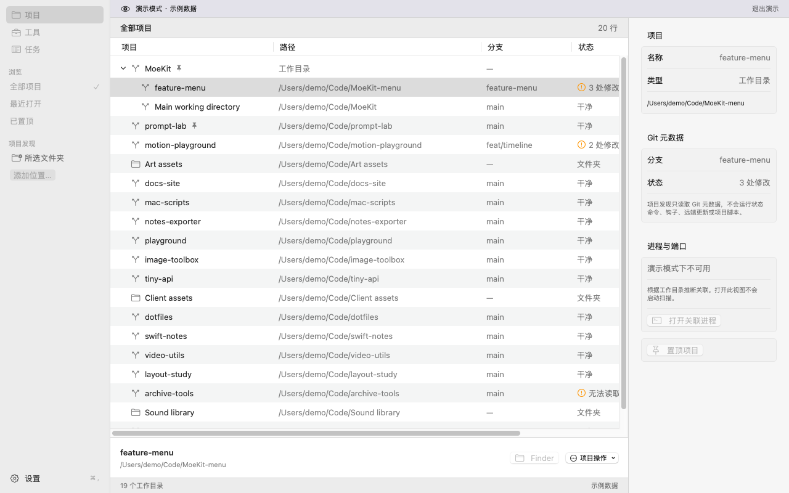

# MoeKit

把项目、磁盘整理和本地工具放进一个原生 macOS 工作台。

**[下载 preview.11 DMG](https://github.com/cosZone/MoeKit/releases/download/v0.1.0-preview.11/MoeKit-v0.1.0-preview.11-macOS.dmg)** · [ZIP](https://github.com/cosZone/MoeKit/releases/download/v0.1.0-preview.11/MoeKit-v0.1.0-preview.11-macOS.zip) · [更新记录](website/content/changelog/0.1.0-preview.11.md)

macOS 15+ · Apple Silicon / Intel · SwiftUI / AppKit

## 能做什么

- **项目**：发现 Git 项目与 worktree，搜索、置顶、定位，复查后整理已合并的工作树
- **磁盘**：用 Mole 分析目录，清理可重建缓存，管理个人废纸篓
- **Docker**：清理选中的闲置镜像、停止容器和单独确认的未使用构建缓存
- **进程**：查看进程与端口，复查后结束支持的精确选择
- **更新**：通过 Sparkle 检查与安装新版，自动下载安装默认关闭

## 开始使用

1. 下载 DMG，将 MoeKit 拖到 Applications 后打开
2. 在 Projects 选择项目目录；想先看看，可在 Settings → Preview 开启 Demo
3. 使用 Mole 分析前，按 [preview.11 准备指南](https://github.com/cosZone/MoeKit/blob/6b23cb267bdb140fa8f2834638658dbc60dadf90/Documentation/Tool-preparation.md) 配置分析器；清理前核对确认清单

当前仍是开发预览：Apple Development 签名、未公证，macOS 可能阻止打开。永久删除不可恢复；MoeKit 不会自动清理你的数据。preview.9 及更早版本需先手动安装一次。

## 文档与反馈

[使用文档](website/content/docs/index.md) · [功能范围](website/content/docs/status.md) · [反馈问题](https://github.com/cosZone/MoeKit/issues) · [Roadmap](https://github.com/cosZone/MoeKit/issues/40)

Mole 新手准备与 [AI worktree 收尾](Documentation/Git-worktree-finish.md) 已合入后续源码：确认本地合入、可选推送、核验后单独退役。它们及界面／菜单栏改进将随后交付，当前 preview.11 不包含。

开发者：[构建说明](Documentation/Build-and-preview.md) · [架构](Documentation/Architecture.md) · [发布验证记录](website/release-records/0.1.0-preview.11/README.md)

项目许可证尚未确定。Mole 是独立上游项目，其分析器不随 MoeKit 打包。
